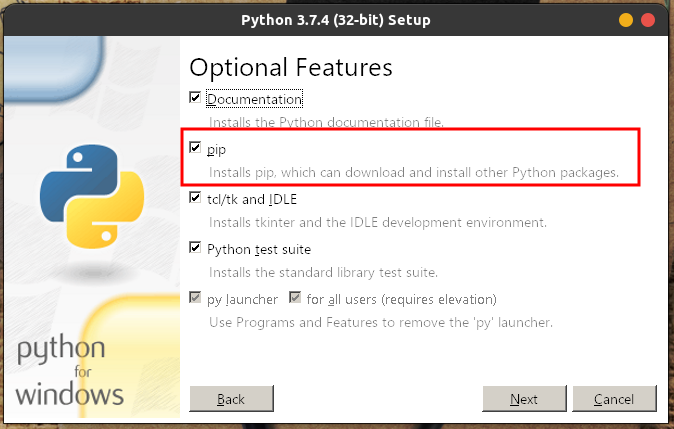
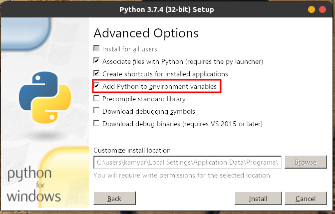

# ForEx Agent

## Getting started
This program only works on wine on linux. It's neither possible to run it on Windows nor on linux. Use the following steps to get it working.

- Install Wine.
    ```
    sudo apt-get install wine-stable
    ```
- Install Python on Wine. [Download python installer](https://www.python.org/ftp/python/3.7.4/python-3.7.4.exe) and run it using Wine. Don't forget to Mark installing pip and adding to environment variables.
    
    

- Install pandas and MetaTrader5 pip packages on wine.
    ```
    wine pip install pandas
    wine pip install MetaTrader5
    ```
- Install MetaTrader 5 on wine Using [this tutorial](https://www.mql5.com/en/articles/625?utm_source=www.metatrader5.com&utm_campaign=download.mt5.linux).
- Make `run.sh` executable.
    ```
    sudo chmod +x run.sh
    ```
- Run the program.
    ```
    ./run.sh
    ```

